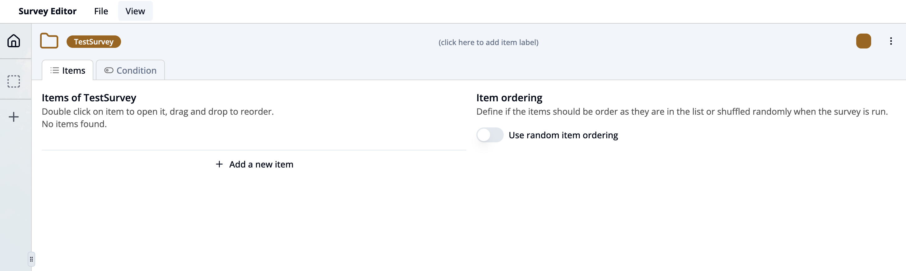
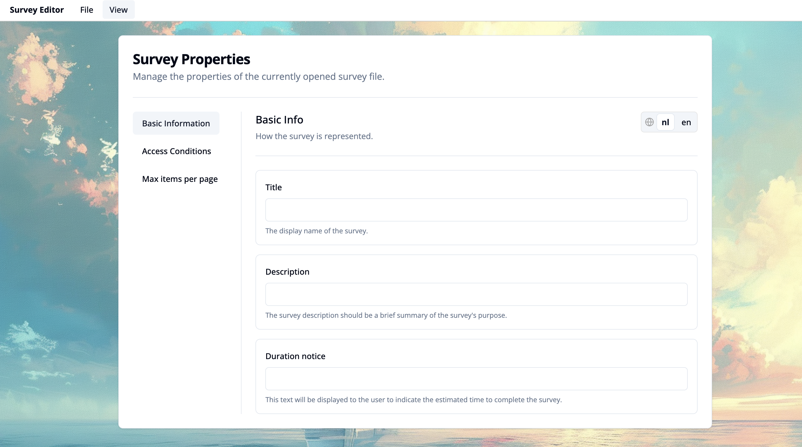
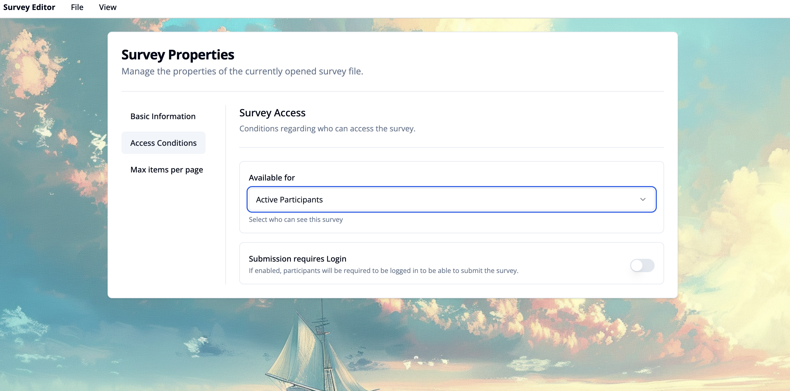
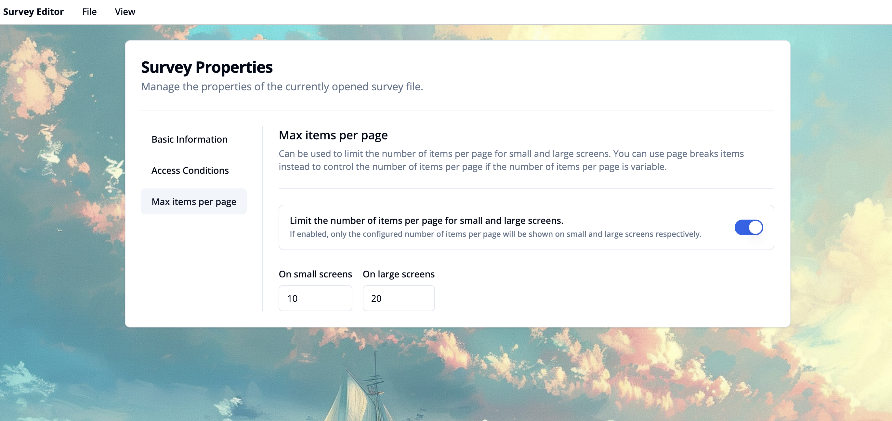
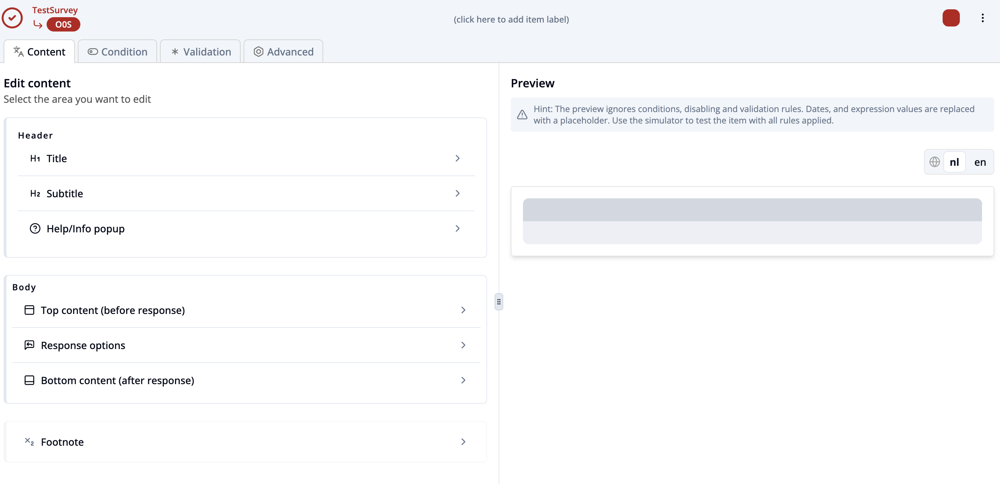

## Item Editor 

This dashboard shows you the content and structure of your survey:
- **Items**: This section lists all the items of the survey. You can click on an item to open it or drag and drop to reorder them. (Read more about [items](/docs/survey-editor/basics/item-structure#survey-item-structure-and-functions).)
- **Add a new item**: Click this option to create a new survey item.
- **Item ordering**: Here you can define whether the items should appear in the listed order or be shown in random order when the survey runs. Toggle the switch to enable random ordering.
- **Condition tab**: Switch to this tab to define conditional logic that controls when items should be shown based on participant responses.

## Survey Properties Workspace

The **Survey Properties** workspace allows you to define and manage overall configuration and behavior of your survey.
Click on **View** dropdown menu and select **Survey Properties** to open this section (shortcut **⌘ Cmd + 1**). 

### Overview of Functions

- **Basic Information**  
  - **Title**  
    Enter a title of the survey that will be displayed in the participant app.

  - **Description**  
    Provide a brief summary of the survey’s purpose. This helps users understand the context or objective before starting.

  - **Duration Notice**  
    Add an estimated time required to complete the survey.

  - **Language Selection (Top Right)**  
    Use the language toggle to view and edit content in different languages. This helps manage multilingual surveys efficiently.

 

- **Access Conditions**  
  Configure who is allowed to access and complete the survey. 
  - **Available for**
    Select a group of users who should be able to see and access the survey. Common options include:
        - **Everyone**
        - **Active participants**
        - **Temporary participants**
        - **Assigned participants**
  - **Submission requires Login**
    Enable this toggle if participants must be logged in to submit their responses. IF disabled, anyone with access to the survey can submit a response.

- **Max Items per Page**  
  Set the maximum number of question or content items that should appear on a single survey page for small and large screens. 
  This is useful for optimizing readability and user experience across different devices.
  Instead you can use page breaks to control the number of items per page if the number of items per page is variable. 

## Survey Item Interface

### 🧭 Top Navigation Bar

- **Survey Name:** Top left shows the name of the current survey.
- **Item Key:** You can change the item key by clicking on it and entering a new key.
- **Add Item Label:** Enter an item label for easier identification.
- **Three-Dot Menu (Top Right):** Provides besides normal mode additional actions for the current item:
    - `Source code` – View or edit the raw JSON structure of the item.
    - `Copy` – Duplicate the item.
    - `Move to other group` – Move item to another group of questions.
    - `Delete item` – Permanently remove the item from the survey.
- **Tabs:**
    - `Content` – active tab where item text, options and structure is edited.
    - `Condition` – define logic for when the item should be shown.
    - `Validation` – add rules to validate user responses.
    - `Advanced` – set advanced options such as confidential mode or prefill rules.

### 📝 Content Section (Left Side)

All item components are listed here (read more about [item components](/docs/survey-editor/basics/item-structure#survey-item-structure-and-functions)). Select any component by clicking on it to view and edit its settings.

### 🔍 Preview Section (Right Side)

- Shows a live **preview** of the item layout.
- **Language Switch:** Toggle between available languages (e.g., `nl` for Dutch and `en` for English).

