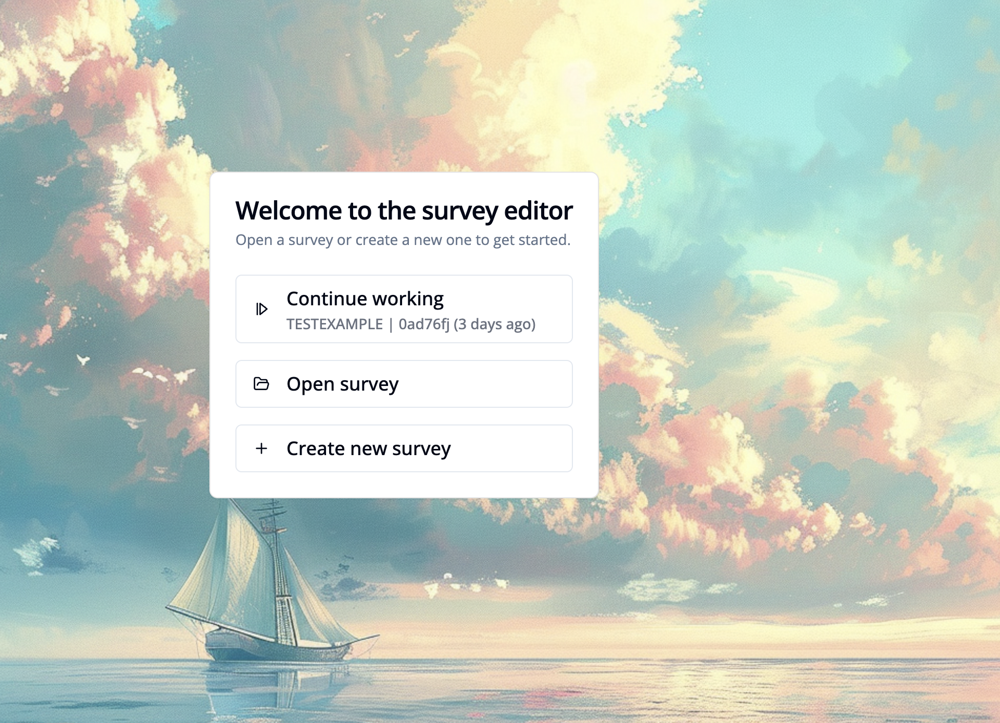
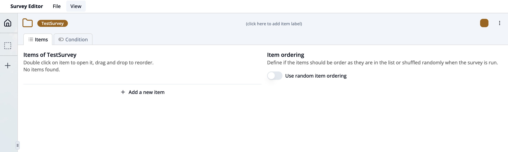

# How to setup a simple survey

## Create a new survey

1. Go to **"Standalone editor"**.
2. Choose section **"Survey editor"**.
3. Click the **"Create new survey"** button and enter a survey key.

You are now ready to edit your new survey! 

This dashboard shows you the content and structure of your survey:
- **Items**: This section lists all the items of the survey. Currently, no items have been added. You can click on an item to open it or drag and drop to reorder them.
- **Add a new item**: Click this option to create a new survey item.
- **Item ordering**: Here you can define whether the items should appear in the listed order or be shown in random order when the survey runs. Toggle the switch to enable random ordering.
- **Condition tab**: Switch to this tab to define conditional logic that controls when items should be shown based on participant responses.

## Add a single choice question to the survey

